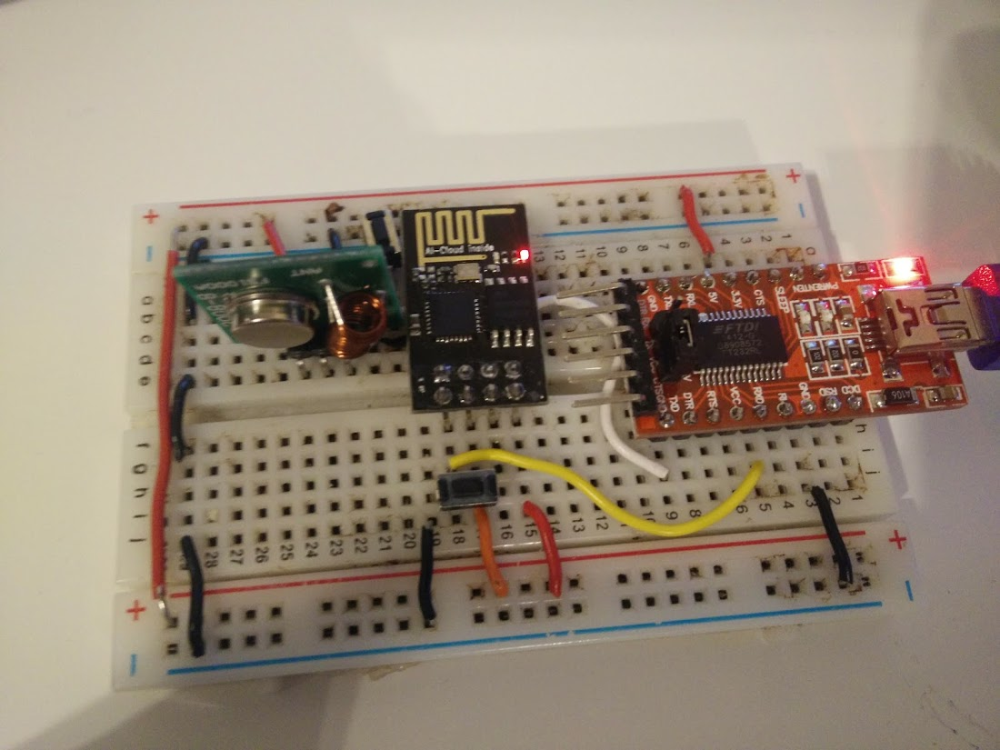
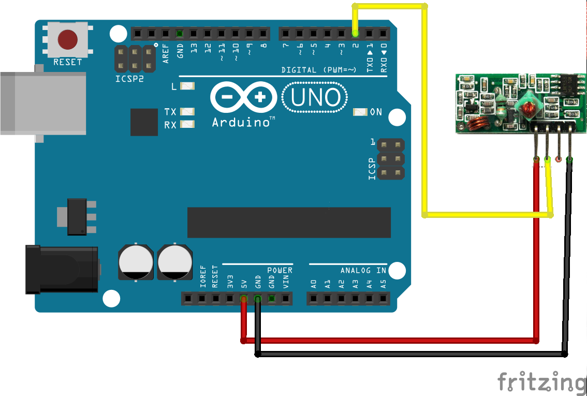
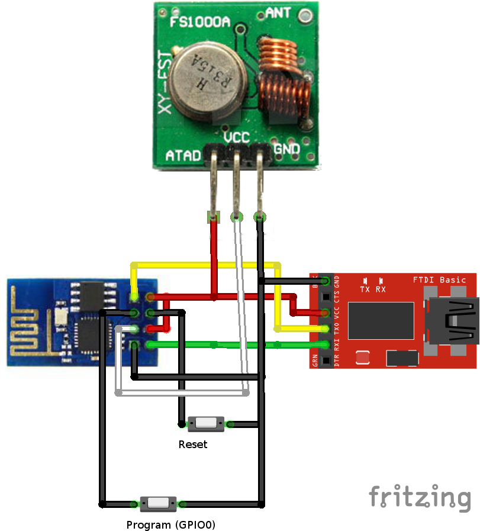
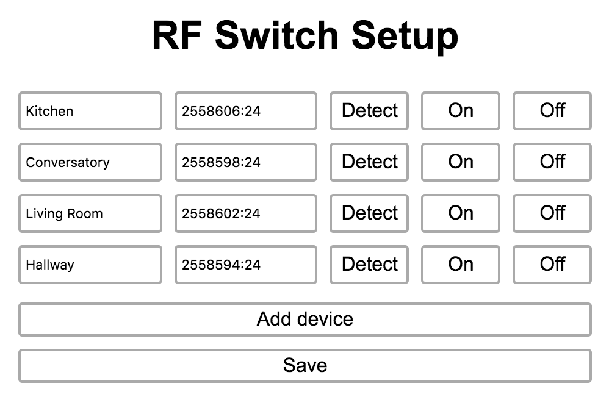

# ESP RF Switch

Control your remote Energenie devices (and other 433Mhz modules) with the ESP8266. Designed to used the my Zetta IoT hub project but will work standalone as well.

This is a fork of [cjdell/esp-rf-switch](https://github.com/cjdell/esp-rf-switch) .
The ESP8266 code is very similar (receiver functionality and auto-wifi have been removed),
but this README is slightly more detailed.

Also, checkout this [Radio + ESP8266 tutorial](http://randomnerdtutorials.com/esp8266-remote-controlled-sockets/)
## Prequisties

- An ESP8266 module (tested using the ESP-12E)
- 433Mhz Receiver module (to use with Arduino)
- 433Mhz Transmitter module (to use with ESP8266)
- The free Arduino IDE.
- USB Serial interface for flashing firmware

### Software dependencies

- ESP8266 libraries
- Rc-switch: https://github.com/sui77/rc-switch

(no autowifi on this version)

## Hardware (ESP8266 + Transmitter)



## Fetch energenie remote values

You only have to do this once, in order to know what Radio values you want to replicate in your transmitter. There are other setups (see below), but this is pretty straightforward.

- Open `arduino-receiver` with the Arduino IDE
- Connect the receiver following the schema:



`Note: Make sure you connect VCC to 5V, otherwise the receiver will NOT work`
(took me a few hours to debug)

Alternative mode: You can use a FTDI device to use the 5V output.
But not the one from the ESP8266, which is 3.3v

## ESP8266 transmitter configuration

- Open `esp8266-trasmitter` with the Arduino IDE
- Connect the receiver following the schema:



### Upload code

- Press Program and reset to start ESP8266 in program mode
- Upload the code (restart in running mode after upload).

- Open the console in Arduino IDE to check the IP address
- Open browser to ``http:\\192.168.x.x\setup displayed on the console
- Add your devices previously captured with the Arduino
- Save and test with the `On` / `Off` buttons



## Example energenie remote values

* 1 ON 6916879:24

Advanced result:
```
Decimal: 6916879 (24Bit) Binary: 011010011000101100001111 Tri-State: not applicable PulseLength: 216 microseconds Protocol: 1
Raw data: 6704,196,640,604,228,608,228,196,640,608,224,200,636,196,640,608,224,608,224,200,640,192,644,192,644,604,224,196,644,604,232,604,228,196,640,24,288,372,60,40,76,32,52,20,40,40,52,60,156,
```

* 1 OFF 6916878:24
* 2 ON 6916871:24
* 2 OFF 6916870:24
* 3 ON 6916875:24
* 3 OFF 6916874:24
* 4 ON 6916867:24
* 4 OFF 6916866:24
